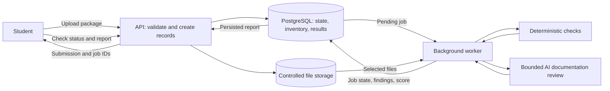
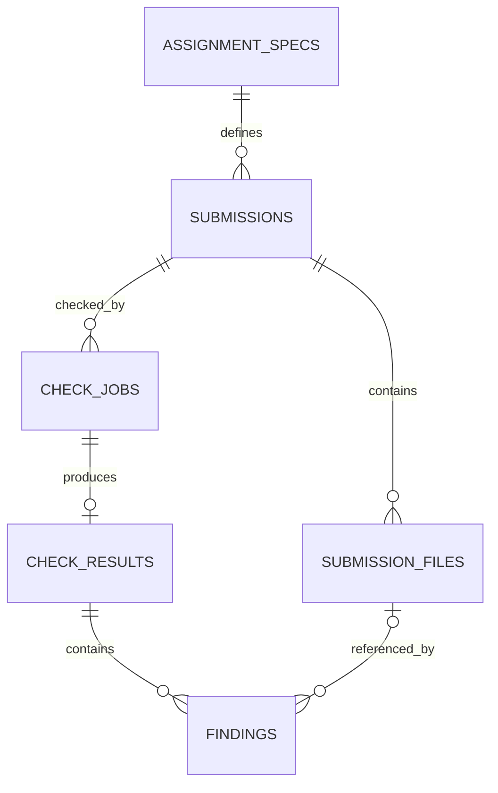

Architecture Proposal: AI Submission Pre-flight Checker

## 1. Problem and primary user

The primary user is a university student preparing to submit a programming assignment. Missing files, unclear setup instructions, inconsistent documentation, and undeclared dependencies can make a package difficult to review or reproduce. The proposed checker gives the student a report with specific findings and evidence before submission.

The first version targets one predefined Python assignment structure. It is a preparation aid, not an automatic grader or a guarantee that every academic requirement has been met.

## 2. Primary workflow

1. The student uploads a package containing a PDF report, README, Python source code, and `requirements.txt` for a predefined assignment specification.
2. The API checks file presence, accepted types, and package limits. Invalid packages receive a specific validation error.
3. The API creates a `Submission` record and a `SubmissionFile` inventory for an accepted package.
4. The API creates a pending `CheckJob`, marks the submission queued, and returns submission and job IDs.
5. A worker claims the job, marks the submission checking, extracts relevant text, and runs fixed deterministic checks.
6. A bounded AI function reviews README and relevant report text against the checklist for missing, unclear, or inconsistent documentation. It returns findings with evidence.
7. The worker stores a `CheckResult`, individual `Finding` records, a readiness score, and final job and submission states.
8. The student retrieves status and the report, reviews the findings, and may upload a corrected package as a new submission.

**Exception path:** If the job cannot complete, the worker records the error and marks the job and submission failed. The API shows a visible failure and offers a new check attempt. If only AI review is unavailable, the worker completes the deterministic checks, records AI review as unavailable, and returns a partial report.

## 3. Architecture and responsibilities

The API handles validation and quick record creation. PostgreSQL stores durable workflow state. File storage holds the uploaded package for checking; the retention period needs a team decision. The worker handles document extraction and checks outside the upload request. The AI service reviews only selected documentation, rather than executing submitted code.

## 4. Persistent entities and schema

| Table | Primary key | Important fields | Foreign keys | State or lifecycle |
|---|---|---|---|---|
| `assignment_specs` | `id` | `title`, `checklist_version`, `created_at`, `updated_at` | None | One versioned specification is reused by submissions. The initial checklist is fixed; its exact storage format will be reviewed before migration. |
| `submissions` | `id` | `status`, `created_at`, `updated_at` | `assignment_spec_id` → `assignment_specs.id` | `uploaded` → `queued` → `checking` → `completed` or `failed`. |
| `submission_files` | `id` | `filename`, `file_type`, `file_size`, `storage_path`, `checksum`, `uploaded_at` | `submission_id` → `submissions.id` | Immutable inventory for a submitted package. |
| `check_jobs` | `id` | `status`, `attempts`, `error_message`, `created_at`, `claimed_at`, `completed_at`, `updated_at` | `submission_id` → `submissions.id` | `pending` → `claimed` → `completed` or `failed`. |
| `check_results` | `id` | `readiness_score`, `result_status`, `summary`, `created_at` | Unique `job_id` → `check_jobs.id` | One report per completed job; `result_status` means `ready` or `needs_changes`, not execution status. |
| `findings` | `id` | `check_name`, `source`, `outcome`, `severity`, `description`, `evidence`, `location`, `created_at` | `check_result_id` → `check_results.id`; optional `file_id` → `submission_files.id` | Individual passed, warning, critical, skipped, or unavailable checks. |

Each submission represents one fixed file version. Corrected files create a new submission. Rechecking the same file version may create another job. The result's submission is identified through its job, avoiding a duplicate `submission_id` in `check_results`. Each finding stores a concrete check and evidence rather than hiding the report in an undifferentiated JSON field. All proposed schema changes require Alembic migrations; changing SQLAlchemy models alone will not update PostgreSQL.

## 5. State transitions and ownership

| Record | From | To | Owner and trigger |
|---|---|---|---|
| Submission | Created | `uploaded` | API accepts and stores the package. |
| Submission | `uploaded` | `queued` | API creates a pending check job. |
| Submission | `queued` | `checking` | Worker claims the job. |
| Submission | `checking` | `completed` | Worker persists the report successfully, including partial results if AI is unavailable. |
| Submission | `checking` | `failed` | Worker cannot complete the check and records an error. |
| CheckJob | Created | `pending` | API creates the job. |
| CheckJob | `pending` | `claimed` | Worker claims the job, records `claimed_at`, and increments `attempts`. |
| CheckJob | `claimed` | `completed` or `failed` | Worker stores the final result or failure reason and `completed_at`. |

A completed report with critical findings is still a successfully completed job. A failed job means the checking process did not produce a usable report. The initial retry design creates a new job; automatic retries are deferred until job claim and duplicate-processing behavior have been tested.

## 6. Worker, checks, and AI plan

The Week 7 worker runs a fixed set of checks: required files, filename convention, PDF page limit, presence of README setup and run instructions, and basic consistency between Python imports and `requirements.txt`. Checks record their outcome and evidence. A limited README review asks the AI service to identify potentially missing or unclear documentation against the predefined checklist. The AI output is validated before storage and labeled separately from deterministic findings.

The AI does not assign grades, assess academic correctness, run uploaded code, or automatically block submission. If the AI call fails or returns invalid output, its check is recorded as unavailable while deterministic findings are still returned. Uncertain AI findings are advisory and marked for student review.

For the first vertical slice, the readiness score is the percentage of applicable deterministic checks that pass: `100 × passed / (passed + warning + critical)`, rounded to the nearest whole number. Skipped or unavailable checks are excluded from the denominator and shown separately. If no deterministic check completes, the score is unavailable rather than zero or 100. AI findings are advisory and do not change the numeric score. The report shows the checks performed and the denominator so that a high score cannot hide unavailable checks. The team will review the fixed checklist and severity rules before implementation; this score is a package-readiness indicator, not an academic grade.

## 7. Proposed API contract

| Endpoint | Purpose | Expected response |
|---|---|---|
| `POST /submissions` | Validate and accept an assignment package. | `201` with submission ID, job ID, and initial statuses; `400` with a specific validation error. |
| `GET /submissions/{submission_id}` | Retrieve submission state and file inventory. | Submission metadata and current status. |
| `GET /jobs/{job_id}` | Retrieve processing state and error if applicable. | Job status, timestamps, and safe error message. |
| `GET /submissions/{submission_id}/report` | Retrieve the latest completed readiness report. | Score, findings, evidence, skipped or unavailable checks, and report status. |

These endpoints are proposed, not yet implemented. Before implementation, the team will confirm upload limits, file retention, error responses, and how the latest report is selected when a submission has multiple jobs.

## 8. Risks and scope control

| Risk | Early mitigation |
|---|---|
| Too many languages and package formats | Support one predefined Python assignment structure and one fixed checklist for Week 7. |
| Incorrect AI findings | Require supporting evidence, distinguish AI from deterministic findings, and present uncertain findings for student review. |
| Unsafe uploaded code | Inspect files and documentation only; do not execute student code in the first version. |
| Missing or sensitive uploaded content | Set file limits, restrict access, avoid logging content, and decide a retention period before accepting real student submissions. |

The first scope cut is support for multiple assignment formats or programming languages. Student accounts, dashboards, LMS integration, arbitrary code execution, plagiarism detection, and automatic grading are outside the initial vertical slice.

## 9. Milestones

| Week | Minimum credible outcome |
|---|---|
| 5 | Agreed upload and report API contracts; first migrations and persistent submission, file inventory, and queued job path. |
| 7 | End-to-end demonstration for one Python package, fixed checks, one bounded AI README review, stored findings, and report retrieval. |
| 9 | Reproducible Docker Compose deployment from a clean environment. |
| 11 | Improved failure handling, logs, tests, and AI-unavailable behavior. |
| 12 | Tested final workflow and demonstration with complete and incomplete example packages. |
| 13 | Final submission and documentation review, if required by the course schedule.